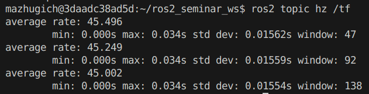

**Отчет о выполнении заданий на семинары по курсу "Навигация и управление автономными мобильными роботами"**
===

**Группа:** *АДМ-24-05*

**Студент:** *Мажуга Никита*

# Семинар 1

## Теория

### 1. ROS2 Graph

Граф ROS2 отвечает за параллельную обработку данных, объединяя все объекты ROS2 в единую сеть.

### 2. ROS2 Nodes

Каждый узел (Node) выполняет одну конкретную задачу, например, управление двигателем или передачу данных с датчиков. Узлы обмениваются данными через ROS2 topics, services, actions и parameters.


### 3. ROS2 Topics

Topics — ключевой компонент графа ROS2, обеспечивающий модульную структуру системы. Они служат каналом связи между узлами для передачи и получения сообщений определенного типа.


### 4. ROS2 Services

Сервисы в ROS2 работают по принципу "запрос-ответ". Они активируются только при вызове клиентом и могут запускать отдельные скрипты или модули.


### 5. ROS2 Actions

Actions похожи на сервисы, но имеют отличия:

- Запрос на выполнение действия можно отменить
- Actions предоставляют обратную связь до достижения цели или отмены запроса клиентом.


### 6. ROS2 Parameters

Параметры — это конфигурируемые переменные узлов, которые можно задавать при запуске или изменять во время работы.

## Команды

1. Команда `ros2 node list`:


2. Команда `ros2 node info /state_publisher`


3. Команда `ros2 topic list`


4. Команда `ros2 topic echo /tf`


5. Команда `ros2 topic info /tf`


6. Команда `ros2 topic hz /tf`



---

## Задание №1. Знакомство с консольными командами ROS 2.

1. Запуск скрипта `demo_nodes_cpp/talker`


2. Запуск скрипта `demo_nodes_cpp/listener`


---

## Задание №2. Turtlesim (робот черепаха 2d)

1. Запуск скрипта `turtlesim/turtlesim_node`


2. Запуск скрипта `turtlesim/turtlesim_teleop_key`


3. Визуализация графа ROS2 через RQT `ros2 run rqt_graph rqt_graph`


---

## Задание №3. Универсальный формат описания роботов (URDF). Робот R2D2.

1. Содержимое текущей директории `ls`


2. Запуск демонстрационного приложения `ros2 launch urdf_tutorial demo.launch.py`


3. Визуализация робота в RViz2 `rviz2 -d ~/ros2_seminars_ws/install/urdf_tutorial/share/urdf_tutorial/r2d2.rviz`


### Отчет о содержимом URDF файла

Описанный робот состоит из 7 звеньев:

1. `axis`
2. `leg1`
3. `leg2`
4. `body`
5. `head`
6. `rod`
7. `box`

Основные свойства описанных звеньев:

- Тензора инерции `inertial`
- Визуальное представление `visual`
- Матрица коллизии `collision`
- Локальная система координат `origin`

Связи между звеньями:

1. `leg1connect`
   - __Предшественник__: `axis`
   - __Дочерний объект__: `leg1`
   - __Дочерний объект__: `fixed`
   - __Описание__: Жесткое соединение, первая опорная конечность робота.
2. `leg2connect`
   - __Предшественник__: `axis`
   - __Дочерний объект__: `leg2`
   - __Дочерний объект__: `fixed`
   - __Описание__: Жесткое соединение, вторая опорная конечность робота.
3. `tilt`
   - __Предшественник__: `axis`
   - __Дочерний объект__: `body`
   - __Дочерний объект__: `revolute`
   - __Описание__: Вращение с ограничением, позволяет телу робота наклоняться.
4. `swivel`
   - __Предшественник__: `body`
   - __Дочерний объект__: `head`
   - __Дочерний объект__: `continuous`
   - __Описание__: Свободное вращение на 360° для головы робота.
5. `periscope`
   - __Предшественник__: `head`
   - __Дочерний объект__: `rod`
   - __Дочерний объект__: `prismatic`
   - __Описание__: Линейное перемещение с ограничением, антенна робота.
6. `boxconnect`
   - __Предшественник__: `rod`
   - __Дочерний объект__: `box`
   - __Дочерний объект__: `fixed`
   - __Описание__: Жесткое соединение, часть антенны.

## Индивидуальные задания

### Внесение изменений в URDF

Добавлен красный цилиндр (`antenna`) как дополнительное звено, прикрепленное к `head`.


__Добавленный код__:

```xml
<!-- New antenna link -->
<link name="antenna">
  <inertial>
    <mass value="0.1"/>
    <inertia ixx="10" ixy="0" ixz="0" iyy="10" iyz="0" izz="10" />
    <origin/>
  </inertial>
  <visual>
    <origin xyz="0 0 0.3" /> <!-- Positioned 0.3m above head center -->
    <geometry>
      <cylinder radius="0.05" length="0.4" />
    </geometry>
    <material name="red">
      <color rgba="1 0 0 1" /> <!-- Bright red for visual distinction -->
    </material>
  </visual>
  <collision>
    <origin xyz="0 0 0.3" />
    <geometry>
      <cylinder radius="0.005" length="0.4" />
    </geometry>
    <contact_coefficients mu="0" kp="1000.0" kd="1.0"/>
  </collision>
</link>

<!-- Joint to connect antenna to head -->
<joint name="antennaconnect" type="fixed">
  <origin xyz="0 0 0.4" /> <!-- Attached to top of head (radius of head = 0.4m) -->
  <parent link="head"/>
  <child link="antenna"/>
</joint>
```

### Изменение закона движения робота

Добавлено движение по эллипсу с параматрами: `a = 2.5`, `b = 1.5` м.


__Изменения в коде__:

```python
...
a, b = 2.5, 1.5
...
odom_trans.transform.translation.x = a * cos(angle)*2
odom_trans.transform.translation.y = b * sin(angle)*2
...
```

---

# Семинар 2

## Теория

### XACRO

`XACRO` расширяет возможности xml и упрощает составление URDF моделей, увеличивает читаемость и редактируемость моделей.

#### Параметры:

```xml
<xacro:property name="the_radius" value="2.1" />
<xacro:property name="the_length" value="4.5" />

<geometry type="cylinder" radius="${the_radius}" length="${the_length}" />
```

#### Математические выражения:

```xml
<xacro:property name="radius" value="4.3" />
<circle diameter="${2 * radius}" />
```

#### Макросы:

```xml
<xacro:macro name="circle_x2" params="radius">
	<circle diameter="${2 * radius}" />
</xacro:macro>

<xacro:circle_x2 radius="12" />
```

### Gazebo в URDF:

Формат URDF при использовыании в Gazebo, поддерживает дополнительные возможности, описываемые внутри элементов `<gazebo>`. Основыными такими возможностями является поддержка различных сенсоров (камер, лидаров, дальномеров и т.д.), контроллеров для реализации той или иной модели управления и возможности по описанию свойств тел (материала, коэфф. трения и т.д.).


Например, вот так выглядит описание diff_drive_controller, это контроллер позволяющий управлять моделью робота с дифференциальным приводом шасси (см. рис. выше) Обычно это два симметрично расположенных на неподвижных осях колеса, которые управляются независимо.

```xml
<gazebo>
    <plugin filename="libgazebo_ros_diff_drive.so" name="differential_drive_controller">

      <ros>
        <namespace>/</namespace>
      </ros>

      <!-- wheels -->
      <left_joint>drivewhl_l_joint</left_joint>
      <right_joint>drivewhl_r_joint</right_joint>

      <!-- kinematics -->
      <wheel_separation>${base_width+wheel_ygap}</wheel_separation>
      <wheel_diameter>${wheel_radius*2}</wheel_diameter>

      <!-- limits -->
      <max_wheel_torque>20.0</max_wheel_torque>
      <max_wheel_acceleration>1.0</max_wheel_acceleration>

      <!-- output -->
      <publish_odom>true</publish_odom>
      <publish_odom_tf>true</publish_odom_tf>

      <odometry_frame>odom</odometry_frame>
      <robot_base_frame>base_footprint</robot_base_frame>
    </plugin>
  </gazebo>
```

Список имеющихся в системе плагинов можно узнать с помощью команды:

```bash
ls /opt/ros/humble/lib | grep libgazebo_ros
```

Результат:


## Задание №1. Запуск симуляции робота TurtleBot3 в Gazebo (URDF для ROS2 и SDF для Gazebo)

1. Выполнил команду `cd src`
2. Склонировал репозиторий `git clone -b humble https://github.com/ROBOTIS-GIT/turtlebot3.git`
3. Вернулся в корневую папку проекта и пересобрал его `ls .. && colcon build --symlink-install`
4. Добавил дополнительный путь поиска моделей роботов для симулятора Gazebo:

```bash
export GAZEBO_MODEL_PATH=$GAZEBO_MODEL_PATH:/opt/ros/humble/share/turtlebot3_gazebo/models/
```

5. Определил тип робота (доступны `burger`, `waffle`, `waffle_pi`):

```bash
export TURTLEBOT3_MODEL=burger
```

6. Запустил симуляцию:

```bash
ros2 launch turtlebot3_gazebo turtlebot3_house.launch.py
```


7. Открыл rviz2, чтобы увидеть то, что "видит" робот своими датчиками.


8. Осуществил управление роботом с помощью `teleop_keyboard`


## Задание №2. Запуск симуляции робота описанного URDF+XACRO (без SDF)

1. Запустил симуляцию `ros2 launch basic_mobile_robot basic_mobile_bot.launch.py`


2. Осуществил управление роботом с помощью кастомного пакета `velocity_control`

- Файл `velocity_control/velocity_control/velocity_control.py`

```python
#!/usr/bin/env python3
import rclpy
from rclpy.node import Node
from geometry_msgs.msg import Twist
import tkinter as tk
from threading import Thread

class VelocityControlNode(Node):
    def __init__(self, root):
        super().__init__('velocity_control_node')
        self.publisher_ = self.create_publisher(Twist, '/cmd_vel', 10)
        self.timer = self.create_timer(0.1, self.publish_velocity)  # Publish at 10 Hz
        self.linear_vel = 0.0
        self.angular_vel = 0.0

        # GUI setup
        self.root = root
        self.root.title("Robot Velocity Control")

        # Linear velocity slider
        tk.Label(root, text="Linear Velocity (m/s): [-1, 1]").pack()
        self.linear_slider = tk.Scale(root, from_=-1.0, to=1.0, resolution=0.01,
                                      orient=tk.HORIZONTAL, length=300,
                                      command=self.update_linear)
        self.linear_slider.set(0.0)
        self.linear_slider.pack()

        # Angular velocity slider
        tk.Label(root, text="Angular Velocity (rad/s): [-3, 3]").pack()
        self.angular_slider = tk.Scale(root, from_=-3.0, to=3.0, resolution=0.01,
                                       orient=tk.HORIZONTAL, length=300,
                                       command=self.update_angular)
        self.angular_slider.set(0.0)
        self.angular_slider.pack()

        # Reset button
        tk.Button(root, text="Reset", command=self.reset_sliders).pack()

        # Quit button
        tk.Button(root, text="Quit", command=self.shutdown).pack()

    def update_linear(self, value):
        self.linear_vel = float(value)

    def update_angular(self, value):
        self.angular_vel = float(value)

    def reset_sliders(self):
        self.linear_slider.set(0.0)
        self.angular_slider.set(0.0)
        self.linear_vel = 0.0
        self.angular_vel = 0.0
        self.get_logger().info("Velocities reset to 0")

    def publish_velocity(self):
        msg = Twist()
        msg.linear.x = self.linear_vel
        msg.angular.z = self.angular_vel
        self.publisher_.publish(msg)
        self.get_logger().info(f'Publishing: linear={msg.linear.x}, angular={msg.angular.z}')

    def shutdown(self):
        self.root.quit()
        self.destroy_node()
        rclpy.shutdown()

def ros_spin(node):
    rclpy.spin(node)

def main():
    rclpy.init()

    # Tkinter setup
    root = tk.Tk()
    node = VelocityControlNode(root)

    # Run ROS 2 spin in a separate thread
    ros_thread = Thread(target=ros_spin, args=(node,), daemon=True)
    ros_thread.start()

    # Start Tkinter main loop
    root.mainloop()

if __name__ == '__main__':
    main()
```

- Модификация файла `velocity_control/setup.py`

```python
    ...
    entry_points={
        'console_scripts': [
            "velocity_controller = velocity_control.velocity_control:main"
        ],
    },
    ...
```


### Характеристики робота

- **Размеры корпуса:**
  - Длина: 0.70 м
  - Ширина: 0.39 м
  - Высота: 0.20 м
  - Масса: 40 кг
- **Ведущие колёса (задние):**
  - Радиус: 0.14 м
  - Ширина: 0.06 м
  - Масса: 110.5 кг на колесо
  - Положение: Смещение назад на 0.221 м от центра, зазор 0.035 м от боков корпуса
- **Опорное колесо (переднее):**
  - Радиус: ~0.09 м (рассчитано как wheel_radius + wheel_zoff - base_height/2)
  - Масса: 10.05 кг
  - Положение: Смещение вперёд на 0.217 м от центра
- **Система координат:**
  - Ось X: Вперёд
  - Ось Y: Влево
  - Ось Z: Вверх

### Структура

- **Ссылки (Links):**
  - `base_footprint`: Проекция центра робота на землю
  - `base_link`: Основной корпус (визуализируется красным в Gazebo)
  - `drivewhl_l_link` и `drivewhl_r_link`: Левое и правое ведущие колёса
  - `front_caster`: Переднее опорное колесо
  - `imu_link`: Заготовка для инерциального измерительного блока
  - `gps_link`: Заготовка для GPS
- **Суставы (Joints):**
  - `base_joint`: Фиксированное соединение между base_footprint и base_link
  - `drivewhl_l_joint` и `drivewhl_r_joint`: Непрерывные суставы для вращения колёс
  - `caster_joint`: Фиксированное соединение для опорного колеса
  - `imu_joint` и `gps_joint`: Фиксированные соединения для датчиков

### Визуализация и физика

- **Визуальные элементы:**
  - Корпус: Загружается из файла 'robot_base.stl'
  - Ведущие колёса: Цилиндры (белые)
  - Опорное колесо: Сфера (белая)
- **Коллизии:**
  - Корпус: Прямоугольная коробка
  - Ведущие колёса: Цилиндры
  - Опорное колесо: Сфера
- **Свойства Gazebo:**
  - Коэффициенты трения опорного колеса: mu1 = 0.01, mu2 = 0.01

### Датчики и плагины

- **IMU:** Прикреплён к base_link в точке (-0.10, 0, 0.05)
- **GPS:** Прикреплён к base_link в точке (0.10, 0, 0.05)
- **Плагины Gazebo:**
  - `gazebo_ros_joint_state`: Частота 30 Гц
  - `gazebo_ros_diff_drive`: Контроллер дифференциального привода
    - Расстояние между колёсами: ~0.425 м
    - Диаметр колёс: 0.28 м
    - Максимальный крутящий момент: 20 Н·м
    - Максимальное ускорение: 1 м/с²
    - Публикует одометрию и трансформации (odom -> base_footprint)

---

# Семинар 3

## Задание №1. Управление 3d моделью робота в RVIZ через joint states

1. Запустил симуляцию `youbot` в `rviz2`

```bash
ros2 launch youbot_description rviz.launch.py
```


2. Подвигал робота с помощью `joint states publisher gui`
   
3. Запустил `state_publisher`
   

### Симуляция движения робота:

- **Инициализация**: Скрипт создает паблишер для топика `joint_states` и определяет начальную конфигурацию робота. Начальные значения всех углов поворота равны степеней подвижности 0.
- **Задание траектории движения**: Движение задается списком `path`, где каждый элемент — словарь с временем (`t`, в секундах) и целевыми углами манипулятора (`arm`, в градусах), например: `{'t': 3, 'arm': [169, 60, -140, 100, 167]}`.
- **Интерполяция**: Метод `smother` выполняет линейную интерполяцию между текущими и целевыми углами поворота степеней подвижности. Коэффициент `d` (от 0 до 1) вычисляется как доля прошедшего времени от общего времени интерполяции. Углы переводятся из градусов в радианы.
- **Публикация**: На каждой итерации (с частотой 30 Гц) отправляется сообщение `JointState` с текущими значениями углов поворота и публикуется в топик `joint_states`. Это позволяет симулятору (например, Gazebo) или визуализатору (RViz) отобразить движение.
- **Цикл**: Движение продолжается, пока не выполнены все шаги `path` или не прервано вручную.

### Задание команд управления:

- **Формат**: Команды задаются через список `path`. Каждый элемент содержит время (`t`) и углы для 5 суставов манипулятора (`arm`). Например, `{'t': 3, 'arm': [169, 60, -140, 100, 167]}` означает переход к этим углам за 3 секунды.
- **Ограничения**: Управление применяется только к манипулятору (`arm_joint_1`–`arm_joint_5`). Виртуальные суставы базы и колеса остаются неподвижными (0).
- **Интерполяция**: Переходы между состояниями выполняются плавно благодаря интерполяции в методе `smother`.

## Задание №2. Программируем траекторию и запускаем на реальном роботе

1. Реализовал свой алгоритм управления в файле `src/youbot_description/scripts/state_publisher.py`

```python
path = [
    # Начальная позиция (центр нижнего круга)
    {"t": 2, "arm": [0, 30, -90, 90, 0]},
  
    # Нижний круг (против часовой стрелки)
    {"t": 3, "arm": [20, 40, -90, 90, 0]},  # Правая нижняя точка
    {"t": 3, "arm": [0, 50, -90, 90, 0]},   # Верхняя точка нижнего круга
    {"t": 3, "arm": [-20, 40, -90, 90, 0]}, # Левая нижняя точка
    {"t": 3, "arm": [0, 30, -90, 90, 0]},   # Возврат в центр
  
    # Переход к верхнему кругу
    {"t": 2, "arm": [0, 50, -90, 90, 0]},   # Центр верхнего круга
  
    # Верхний круг (по часовой стрелке)
    {"t": 3, "arm": [20, 60, -90, 90, 0]},  # Правая верхняя точка
    {"t": 3, "arm": [0, 70, -90, 90, 0]},   # Верхняя точка верхнего круга
    {"t": 3, "arm": [-20, 60, -90, 90, 0]}, # Левая верхняя точка
    {"t": 3, "arm": [0, 50, -90, 90, 0]},   # Возврат в центр верхнего круга
  
    # Возврат в начальную позицию
    {"t": 2, "arm": [0, 30, -90, 90, 0]},
]
```

2. Запустил `state_publisher` с новой траекторией
   
